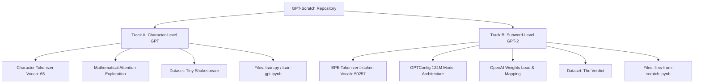

# 🧠 GPT-Scratch Laboratory

Welcome to the **GPT-Scratch Laboratory**, an educational sandbox and codebase designed to build, deconstruct, and train decoder-only Generative Pre-trained Transformer (GPT) models from absolute scratch in **PyTorch**. 

This repository serves as a hands-on guide to understanding the mathematical, structural, and programming mechanics of modern Large Language Models (LLMs). It brings together concepts and implementations inspired by two premier learning paths:
1. **Andrej Karpathy's "Neural Networks: Zero to Hero" series** (and the optimized [nanoGPT](https://github.com/karpathy/nanoGPT) library).
2. **Sebastian Raschka's book "Build a Large Language Model (From Scratch)"**.

---

## 🗺️ Project Tracks: Dual Architecture Implementations

This repository is split into two distinct tracks, each illustrating a different approach to tokenization, scale, and training paradigms.



### Track A: Character-Level GPT (Karpathy Lecture Series)
* **Objective**: Demystify the base mechanics of self-attention blocks and raw training loops with minimal tokenization overhead.
* **Tokenization**: Simplistic character-level tokenizer (mapping each unique character to an integer; vocabulary size of 65).
* **Architecture**: A compact Transformer decoder ($\sim 10.8\text{M}$ parameters) consisting of:
  - Multi-Head Causal Self-Attention (6 heads, 64 dimension per head = 384 embedding dimension).
  - Pre-Layer Normalization and Residual Connections.
  - Position Embedding Table (learned absolute positional embeddings).
  - ReLU-based Feed-Forward Networks.
* **Dataset**: `tiny-shakespeare.txt` (1.11MB corpus of Shakespeare's plays).
* **Key Learning Resource**: [train-gpt.ipynb](file:///Users/subhajithait/Documents/testing/gpt-scratch/train-gpt.ipynb) and [train.py](file:///Users/subhajithait/Documents/testing/gpt-scratch/train.py).

### Track B: Subword-Level GPT-2 (Raschka Book Implementation)
* **Objective**: Scale up to production-grade model configurations, integrate subword tokenization, implement advanced sampling, and import/fine-tune pre-trained weights.
* **Tokenization**: Byte-Pair Encoding (BPE) using OpenAI's `tiktoken` library (vocabulary size of 50,257).
* **Architecture**: 124M parameter GPT-2 configuration:
  - 12 Transformer layers, 12 attention heads, 768 embedding dimension, and a context length of 1024.
  - GELU activation function in Feed-Forward networks.
  - Bias weights enabled for Query, Key, and Value projections (`qkv_bias=True`).
* **Pre-trained Weight Translation**: Dynamically downloads the official OpenAI GPT-2 small checkpoint from Hugging Face and manually maps/loads the parameters into the scratch-built PyTorch module.
* **Text Generation Strategies**: Implements advanced decoding techniques:
  - Greedy decoding.
  - Temperature scaling (controlling probability distribution sharpness).
  - Top-k sampling (filtering out low-probability tail tokens).
* **Dataset**: `the-verdict.txt` (a short story by Edith Wharton for local fine-tuning).
* **Key Learning Resource**: [llms-from-scratch.ipynb](file:///Users/subhajithait/Documents/testing/gpt-scratch/llms-from-scratch.ipynb).

---

## 📂 Repository Directory

| File / Folder | Type | Description |
| :--- | :--- | :--- |
| [train.py](file:///Users/subhajithait/Documents/testing/gpt-scratch/train.py) | Python Script | Executable PyTorch training script for character-level GPT. Trains on `tiny-shakespeare.txt` and generates sample text. |
| [train-gpt.ipynb](file:///Users/subhajithait/Documents/testing/gpt-scratch/train-gpt.ipynb) | Jupyter Notebook | Step-by-step interactive companion to Karpathy's video lecture. Contains attention math deconstructions. |
| [llms-from-scratch.ipynb](file:///Users/subhajithait/Documents/testing/gpt-scratch/llms-from-scratch.ipynb) | Jupyter Notebook | Complete implementation of Sebastian Raschka's book stages: data pipeline, self-attention, GPT-2 architecture, OpenAI weight loading, and fine-tuning. |
| [tiny-shakespeare.txt](file:///Users/subhajithait/Documents/testing/gpt-scratch/tiny-shakespeare.txt) | Text Document | Dataset for the character-level model containing Shakespeare's writings. |
| `.gitignore` | Config | Specifies patterns of files/directories (like `.venv/` or cached model checkpoints) to ignore. |

---

## 🛠️ Architectural Deep-Dive

To build a decoder-only Transformer from scratch, the code implements several key mathematical modules in PyTorch:

### 1. Token & Position Embeddings
For a batch of input token indices of shape $(B, T)$ (Batch size, Sequence context length):
* **Token Embedding**: Looks up the continuous vector representation for each token using a matrix of shape $(\text{Vocab Size}, C)$.
* **Positional Embedding**: Looks up the continuous vector representation for each absolute position in the sequence using a matrix of shape $(\text{Context Length}, C)$.
* **Combination**: The vectors are added element-wise:
  $$x = x_{\text{token}} + x_{\text{pos}}$$

### 2. Causal Multi-Head Self-Attention (MHSA)
Attention represents a communication mechanism where tokens aggregate information from historical tokens. 

```
Input Vector (x) ---> Linear Projections ---> Q, K, V
                          |
                          v
                   Q @ K^T / sqrt(d_k)
                          |
                          v
                     Causal Mask (tril) ---> Softmax ---> Dropout ---> (Attention Weights @ V)
```

* **Query, Key, and Value ($Q, K, V$)**: For input $x$, we compute projections:
  $$Q = xW_q, \quad K = xW_k, \quad V = xW_v$$
* **Scaled Dot-Product Affinity**: Scaled by the head size dimension ($d_k$) to prevent the Softmax from saturating:
  $$\text{Score}(Q, K) = \frac{Q K^T}{\sqrt{d_k}}$$
* **Causal Masking**: A lower-triangular mask (`tril`) sets future tokens to $-\infty$ so that the model cannot look ahead during autoregressive training:
  $$\text{Masked Score}_{i,j} = \begin{cases} \text{Score}_{i,j} & \text{if } j \le i \\ -\infty & \text{if } j > i \end{cases}$$
* **Attention Distribution**: Softmax is applied to convert affinities to probabilities:
  $$\text{Attention Weights} = \text{Softmax}(\text{Masked Score})$$
* **Weighted Value Aggregation**: Attention weights are multiplied by the value vectors to yield the head output:
  $$\text{Head}(x) = \text{Attention Weights} \times V$$

### 3. Layer Normalization (Pre-LN Block Design)
Unlike the original Transformer paper which placed LayerNorm *after* residual connections (Post-LN), modern GPT architectures place LayerNorm *before* attention and feedforward projections (Pre-LN). This provides a direct gradient pathway from the output back to the early layers, enabling training stability at scale:
$$\text{Output} = x + \text{SelfAttention}(\text{LayerNorm}(x))$$
$$\text{Final Output} = \text{Output} + \text{FeedForward}(\text{LayerNorm}(\text{Output}))$$

---

## 🔗 Referenced Resources & Research Papers

The following external resources are linked, discussed, and analyzed in the notebooks and script comments:

* **[Transformer Explainer](https://poloclub.github.io/transformer-explainer/)**: A WebGL-powered interactive visualization demonstrating how GPT-2 processes tokens and computes attention matrices in real-time.
* **[Attention Is All You Need (ArXiv)](https://arxiv.org/abs/1706.03762)**: The seminal 2017 paper by Vaswani et al. introducing the self-attention mechanism and replacing recurrent/convolutional layers.
* **[Language Models are Few-Shot Learners (ArXiv)](https://arxiv.org/abs/2005.14165)**: The OpenAI paper describing the architecture, dataset, and zero/few-shot in-context learning properties of GPT-3.
* **[OpenAI ChatGPT Blog](https://openai.com/blog/chatgpt/)**: Announcement detailing the introduction of Instruction Tuning and Reinforcement Learning from Human Feedback (RLHF).
* **[Andrej Karpathy's Zero to Hero Course](https://karpathy.ai/zero-to-hero.html)**: The standard-setting educational lecture series on neural networks, backpropagation, and autoregressive models.
* **[nanoGPT Repository](https://github.com/karpathy/nanoGPT)**: A clean, highly optimized repository for training medium-sized GPTs with optimizations such as PyTorch Compile and mixed precision.

---

## 🚀 Setup & Execution Guide

### Prerequisites
* Python 3.10+
* PyTorch 2.0+ (with CUDA/MPS support if available)
* pip package manager

### 1. Environment Installation
Clone the repository and set up a Python virtual environment:
```bash
# Navigate to workspace
# Create a virtual environment
python3 -m venv .venv

# Activate the virtual environment
source .venv/bin/activate

# Install dependencies
pip install --upgrade pip
pip install torch torchvision torchaudio tiktoken transformers notebook tqdm matplotlib
```

### 2. Training the Character GPT Model (`train.py`)
Run the training script to train the model on the Tiny Shakespeare text. The script dynamically routes execution to GPU (CUDA/Apple Silicon MPS) if available:
```bash
# Run training and pipe output to a log file
python train.py 2>&1 | tee -a train.log
```

> [!NOTE]
> During training, the script will output loss diagnostics every 500 iterations, calculate validation losses, and output a 500-character generated sample at the end of the 5,000 steps.

### 3. Launching Notebooks
Open the notebooks to interactively run the training pipelines, step-by-step attention visualizations, and GPT-2 weight migrations:
```bash
jupyter notebook
```
- Open `train-gpt.ipynb` to step through the self-attention equations mathematically.
- Open `llms-from-scratch.ipynb` to execute the Raschka Book stages and map pretrained GPT-2 weights.
